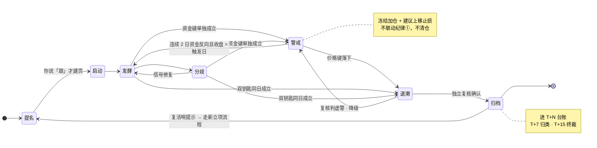

# A 股主线研究与决策支持系统

[](https://github.com/Taosheng777/a-share-mainline-os/actions/workflows/ci.yml)
[](https://github.com/Taosheng777/a-share-mainline-os/actions/workflows/live-smoke.yml)
[](LICENSE)

[English](README_EN.md)

**每个交易日收盘后，用一次对话拿到一页复盘**：今天什么环境、你跟的主线还活着吗、你的持仓有没有踩到**你自己定的**纪律线。

它是给 Claude Code 与 Codex 用的 A 股研究 Skill 套件，围绕「主线」这个一等对象组织复盘、载体筛选与持仓分析。**它只提示，不下单**；每个数字都带来源和数据日，取不到就写「未取得」，不猜、不编。

## 一天是这样的

```text
你：执行最新交易日复盘
 ↓
系统：跑五区 —— ①盘面 ②主线动态 ③主线提名 ④持仓对照 ⑤次日关注
      逐条核对你预先写死的死亡条件与纪律线
 ↓
你拿到：一页 ≤40 行的复盘 + 需要你处理的事项（如果有）
      主线页的证据流自动增量，留 git 快照
 ↓
决定权在你 —— 系统给建议、给依据、给反方，你确认后自己去交易
```

## 它给你什么

真实产出长这样（片段取自[完整演示日](examples/演示复盘.md)，**全文虚构**）：

> [!abstract] 震荡轮动 · 指数窄幅、资金收缩到少数板块
> **今天最需要你处理的一件事**：`DEMO001 示例科技ETF` 已跌破止损位，纪律②触发，等你给次日处理决定。

> [!danger] 纪律② 触发 · 需你决定
> `DEMO001 示例科技ETF` 收 **1.238** ≤ 止损位 **1.250**（距止损 **−0.96%**）。系统只提示，**不代下单**。

> [!warning] 主线「示例主线·甲」转入 警戒 · 冻结加仓
> 资金键成立（锚板块连续 2 日主力净流出），**价格键未落下**（收盘 1,842.60 > MA20 1,795.20）。
> 按双钥匙规则判 `警戒`，**不是退潮，不联动纪律①、不清仓**。

它也会主动拆自己的台——同一份复盘里，一条提名被自己标成高风险：

> ⚠️ **A 股执行链未验证，证据高风险**：涨停梯队零映射与无 A 股催化落点同时出现。
> 本条**不得**被表述为「A 股承接已成立」。

📄 两份完整样例：[演示复盘](examples/演示复盘.md)（五区全填） · [演示主线页](examples/演示主线页.md)（双钥匙状态头 + 证据流双层 + 载体 T+N 秩相关）

## 它不做什么

| 边界 | 含义 |
|---|---|
| **不下单** | 不生成委托、不碰账户。触发只产生提示与建议，执行永远是你的动作。 |
| **不编数据** | 每个数字带来源与数据日；三条通道都取不到就写「未取得」，缺数据的判定写「本项未验证」，**绝不默认判「未触发」**。 |
| **不替你定纪律** | 三条纪律线的阈值只从你的 `01-纪律卡.md` 运行时读取，不固化在代码里。你没填，系统就写「不可判定」。 |
| **不给投资建议** | 提供方非持牌证券投资咨询机构；本项目及其输出不构成投资建议，使用者风险自担。 |
| **不做定时任务** | 只在你在场时手动触发，不创建 cron、后台监控或自动化。 |

## 主线是怎么活和怎么死的



**为什么中间要卡一道「警戒」**：纯资金符号条件（连续 N 日净流出、聚合窗口转负）在板块逐日史上的误报底率很高，触发后的前向收益与不触发几乎没有区别——信号本身几乎不含信息。让它单独扣动清仓，等于装了个每隔几天误响一次的警报；真正的代价不是某一次误杀，而是人会因此在关键时刻不再信任触发器。所以双钥匙的定位是**安全结构，不是已被证明有效的预测器**，它不声称提高了预测精度。

## 三个 Skill

| Skill | 做什么 | 不做什么 |
|---|---|---|
| `stock-daily` | 最新交易日五区复盘、环境判定、主线状态与持仓纪律对照 | 不把机械候选池冒充正式提名，不补写断更日记 |
| `stock-screener` | 为已立项主线筛选 ETF 与龙头股，做相关度校验和四维排序 | 不替代账户适配与买卖判断 |
| `stock-buddy` | 主线答辩、体检、退潮复核、持仓分析；显式开启时运行五维专家模式 | 不代下单，不在输入不足时硬造目标区间或个性化仓位 |

## 核心设计

- **死亡条件先写死，再强制误报回测**：立项前写明可判定条件、标的或指数代码、基线点位与基线数据日；并回测该组合在过去 60 个交易日触发几次，> 1 次即改写。禁止事后追着行情改规则。
- **判定是确定性的、可回放的**：机械判定走 `mainline_validation.py` 的真值表，缺数据返回 `unverified` 而不是静默判「未触发」；一组结构化案例随仓库发布，改语义就得同轮补案例。
- **判完之后还要回头看**：复核判据立项当轮预注册（必须含非资金维度，否则复核与触发同源）、T+N 台账机械归类、复活哨提示疑似误杀——**提示不是买回信号**，归类为误杀也不倒推已执行的纪律动作。
- **三层决策合同**：纪律层只读你的事实；AI 建议层给明确倾向、依据、反方与改判条件；执行层由你确认并自行交易。
- **防锚定接力**：机械候选池与正式提名分角色生成；后段先独立扫描再取并集，避免候选先验锁死判断。
- **多源降级与宽度对账**：低成本通道优先，单源失败只降级；涨跌家数要求写入源与影子源对账，冲突不得静默吸收。

更完整的规则见[主线生命周期](docs/主线生命周期.md)与[系统设计](docs/系统设计.md)。

## 五分钟上手

### 1. Clone 并安装

```bash
git clone https://github.com/Taosheng777/a-share-mainline-os.git
cd a-share-mainline-os
```

Codex marketplace：

```bash
codex plugin marketplace add Taosheng777/a-share-mainline-os
codex plugin add a-share-mainline-os@a-share-mainline-os
```

Claude Code marketplace：

```text
/plugin marketplace add Taosheng777/a-share-mainline-os
/plugin install a-share-mainline-os@a-share-mainline-os
```

也可用已测试的本地安装器：

```bash
bash adapters/codex/install.sh   # 或 bash adapters/claude/install.sh
```

安装器默认拒绝覆盖同名 Skill。升级前先预览，再显式执行：

```bash
bash adapters/codex/install.sh --upgrade --dry-run
bash adapters/codex/install.sh --upgrade
```

Claude Code 用户替换为 `adapters/claude/install.sh`。升级只替换三个 Skill，使用同一批次备份，不读取或修改用户 config 与 vault；回滚方法见[升级与回滚](docs/升级与回滚.md)。旧的 `ASM_FORCE_INSTALL=1` 仍兼容，但推荐使用显式参数。

### 2. 建立空 vault 与配置

```bash
cp -R vault-template "$HOME/a-share-mainline-vault"
mkdir -p "$HOME/.config/a-share-mainline"
cp config/config.example.json "$HOME/.config/a-share-mainline/config.json"
```

把配置中的 `__VAULT_ROOT__` 改为刚复制的绝对路径，然后打开 `01-纪律卡.md` 自行填写三条线。阈值为空时系统会明确写“不可判定”，不会从旧记录或模型记忆猜补。

### 3. 安装免费数据 Skill

```bash
python3 adapters/shared/install_a_stock_data.py \
  --target "$HOME/.codex/skills/a-stock-data"
```

Claude Code 用户把目标改为 `$HOME/.claude/skills/a-stock-data`。安装器固定并校验上游 `v3.6.1` 的 commit、`SKILL.md` 指纹和 Apache-2.0 许可证；本仓库不复制或重新许可上游源码。

### 4. 开始使用

在新任务中说：

- `执行最新交易日复盘`
- `为我已立项的主线筛选 ETF 和龙头股`
- `用 stock-buddy 体检这条主线`

首次配置后运行只读检查：

```bash
python3 scripts/doctor.py --platform codex
```

更完整的逐步说明见 [五分钟上手](docs/五分钟上手.md)。本地可重复冷启动检查：

```bash
python3 scripts/cold_start.py
```

该脚本在临时 HOME 中验证 Codex marketplace、安装器、空 vault、复盘前置读取和离线载体筛选，不读取现有用户目录。

## 数据源与降级

- `a-stock-data`：默认免费外部依赖，覆盖腾讯、东财等公开数据通道。
- **板块逐日缓存**：`stock-daily/scripts/board_fund_flow_cache.py` 是**本仓库自有代码**（不属于上游 `a-stock-data`），把全板块逐日主力净额、四档资金与板块收盘点位存进本地 SQLite，供 MA20 价格键、「连续 N 日」条件回溯、立项误报回测和 T+N 台账回填使用。库位置由 `A_STOCK_DATA_HOME` 指定。**缓存是逐日累积的，新装时历史很短**；覆盖不足时所有依赖它的判定一律写「本项未验证」，不会默认判「未触发」，也不阻断其余复盘区。
- `hithink-finance`：可选的结构化数据层，由用户自行安装、认证并遵守服务条款。
- 问财 `hithink-market-query`：可选适配器，用于正面清单内查询；凭据只从本机环境读取。
- iFinD helper、`news-search`、`report-search` 等：不随发行包提供；只有用户自行安装并显式配置时才启用。

任一可选组件不可用时必须在输出中明示降级，不得猜作者目录、复用过期数据或编造字段。详见 [配置与可选数据源](docs/配置与可选数据源.md)和[系统设计](docs/系统设计.md)。

## 仓库结构

```text
.agents/                         Codex marketplace
.claude-plugin/                  Claude Code marketplace
plugins/
  a-share-mainline-os-codex/     Codex 插件根与 skills/
  a-share-mainline-os-claude/    Claude Code 插件根与 skills/
adapters/                        安装器与外部数据薄适配
src/skills/                      公开 canonical 业务基线（Claude-compatible）
vault-template/                  脱敏空壳与契约测试
docs/                            设计、生命周期、配置与许可证说明
examples/                        纯虚构输出样例
scripts/                         冷启动、固定源导出与发行构建
tests/                           产品发布契约
```

两个平台版本由仓库内 `src/skills/` 和同一份白名单确定性导出；平台工具名只在导出适配层变化。任何公开 clone 都可运行 `python3 scripts/export_from_source.py --check` 验证分发树，不依赖作者私人目录。

## 许可证与第三方边界

本仓库自有代码与文档采用 [MIT License](LICENSE)。数据能力通过 Simon Lin 的 [simonlin1212/a-stock-data](https://github.com/simonlin1212/a-stock-data) 接入；该项目采用 Apache-2.0，本仓库不复制、不修改、不再分发其源码。完整归属和审计快照见 [NOTICE](NOTICE) 与 [依赖许可证清单](docs/依赖许可证清单.md)。

本项目不附带行情、公告、研报、新闻、账户凭据、API Key 或私人数据。公开网页接口并不等于获得官方 API 或数据再分发授权；接口可能变更、限流或失效。使用者须自行遵守各服务条款、授权范围和频率限制。

## 参与贡献

提交问题时请附复现命令、脱敏输入、实际输出和数据日，不要上传 API Key、券商截图或账户明细。贡献规则见 [CONTRIBUTING.md](CONTRIBUTING.md)，安全问题见 [SECURITY.md](SECURITY.md)。

离线发布门可用 `python3 scripts/run_ci.py` 一次复现。定时 `Live smoke` 只读探测固定的 `a-stock-data` 上游 revision 与腾讯免费行情主干；失败会保留日志并开 Issue，但不阻断离线 CI 或发布。
