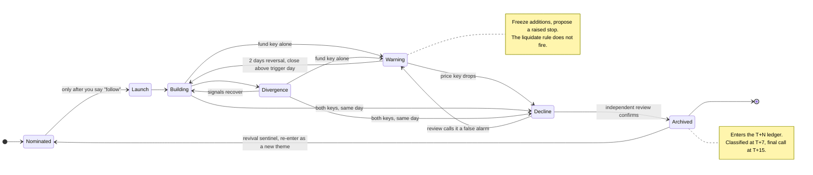

# A-Share Mainline Research and Decision Support

[](https://github.com/Taosheng777/a-share-mainline-os/actions/workflows/ci.yml)
[](https://github.com/Taosheng777/a-share-mainline-os/actions/workflows/live-smoke.yml)
[](LICENSE)

[中文](README.md)

**After each trading day closes, one conversation gets you a one-page review**: what regime today was, whether the themes you follow are still alive, and whether your positions crossed **the rules you wrote yourself**.

It is a Claude Code and Codex Skill suite for China A-share research, organized around "themes" as first-class objects. **It only tells you; it never trades.** Every number carries a source and an as-of date, and anything unavailable stays written as unavailable.

## A day looks like this

```text
You:  Review the latest trading day
  ↓
System: runs five sections — regime · theme status · nominations ·
        position check · tomorrow's watchlist
        checking each failure condition and rule threshold you pre-registered
  ↓
You get: a ≤40-line review page + the items that need your decision (if any)
         theme pages get an incremental evidence trail and a git snapshot
  ↓
The call is yours — the system gives a recommendation, its basis, and the
counter-argument; you confirm and place any trade yourself
```

## What the output looks like

Excerpts from the [full demo day](examples/演示复盘.md) (**entirely fictional**; the demo files are in Chinese, as is the tool's output):

> [!abstract] Range-bound rotation · indices flat, funds concentrating into few sectors
> **The one thing needing your decision today**: `DEMO001` broke below its stop; rule ② fired.

> [!danger] Rule ② fired · your decision needed
> `DEMO001` closed at **1.238** ≤ stop **1.250**. The system only flags this; **it does not place orders**.

> [!warning] Theme "Example Theme A" moved to `warning` · additions frozen
> Fund key met (anchor board saw two consecutive days of net outflow), **price key not met** (close 1,842.60 > MA20 1,795.20).
> Under the two-key rule this is `warning`, **not a decline — the liquidate rule does not fire**.

It also argues against itself. In the same review, one of its own nominations is flagged:

> ⚠️ **A-share execution chain unverified; evidence is high-risk**: zero limit-up mapping and no A-share catalyst landing occurred together.
> This nomination **must not** be phrased as "A-share follow-through confirmed".

📄 Two complete samples: [demo review](examples/演示复盘.md) (all five sections filled) · [demo theme page](examples/演示主线页.md) (two-key status header, two-layer evidence trail, vehicle rank correlation)

## What it will not do

| Boundary | What it means |
|---|---|
| **No orders** | No order generation, no account access. A trigger produces a prompt and a recommendation; execution is always your action. |
| **No invented data** | Every number carries a source and as-of date. If all three channels fail, it writes "unavailable"; a check missing its inputs is written "not verified" and is **never defaulted to "not triggered"**. |
| **Your rules, not its rules** | The three discipline thresholds are read at runtime from your own rule card, never hardcoded. Leave them blank and the system writes "cannot determine". |
| **No investment advice** | The provider is not a licensed securities investment advisory institution. Neither this project nor its output constitutes investment advice. Users assume all risk. |
| **No scheduled jobs** | It runs only when you trigger it. It never creates cron jobs, background monitors, or automation. |

## How a theme lives and dies



**Why there is a `warning` stage in the middle.** Pure fund-sign conditions (N consecutive days of net outflow, an aggregate window turning negative) have a high false-positive base rate across board history, and forward returns after they fire are barely distinguishable from when they do not — the signal carries almost no information. Letting one pull an irreversible trigger installs an alarm that misfires every few days. The real cost is not any single false kill; it is that people stop trusting the trigger exactly when it matters. So the two-key rule is a **safety structure, not a validated predictor** — it makes no claim to better prediction accuracy.

## Skills

| Skill | Purpose | Boundary |
|---|---|---|
| `stock-daily` | Review the latest trading day, market regime, themes, and position rules | A mechanical candidate pool is never presented as a formal nomination |
| `stock-screener` | Find and rank ETFs and leading stocks for an established theme | Screening does not decide account fit or trades |
| `stock-buddy` | Challenge, monitor, and review themes or positions; run five-dimensional expert mode only when explicitly enabled | No order placement; no fabricated target range or personalized sizing when evidence is insufficient |

## What is different

- **Failure conditions are written first, then backtested for false positives.** Before a condition is accepted, replay the proposed liquidate-level combination over the last 60 trading days using the local board history cache; more than one hit means rewrite it. No rewriting rules after the fact to chase price.
- **Deterministic, replayable classification.** The mechanical decision runs through a truth table in `mainline_validation.py`; a missing key returns `unverified` instead of silently reading as "not triggered". A structured case set ships with the repo, and changing the semantics requires updating the cases in the same change.
- **The system looks back after it decides.** Decline-review criteria are pre-registered at theme creation (and must include at least one non-fund dimension, or the review shares a source with the trigger), every decline decision enters a T+N ledger, and a revival sentinel flags a possible false kill when an archived theme's fund flow reverses. The sentinel is a prompt to re-evaluate, **not a buy signal**, and a "false kill" label never rolls back discipline actions already executed.
- **A three-layer contract**: user-owned discipline facts, explicit AI recommendations, and user-confirmed execution.
- **Anti-anchoring handoff** between a mechanical candidate pool and independent formal nominations.
- **Explicit multi-source degradation** and dual-source market-breadth reconciliation; missing evidence remains missing.

Full rules are in the [theme lifecycle](docs/主线生命周期.md) and [system design](docs/系统设计.md) documents (Chinese).

## Quick start

```bash
git clone https://github.com/Taosheng777/a-share-mainline-os.git
cd a-share-mainline-os
```

Codex:

```bash
codex plugin marketplace add Taosheng777/a-share-mainline-os
codex plugin add a-share-mainline-os@a-share-mainline-os
```

Claude Code:

```text
/plugin marketplace add Taosheng777/a-share-mainline-os
/plugin install a-share-mainline-os@a-share-mainline-os
```

The tested local installers are also available:

```bash
bash adapters/codex/install.sh   # or: bash adapters/claude/install.sh
```

Preview and perform an explicit upgrade with:

```bash
bash adapters/codex/install.sh --upgrade --dry-run
bash adapters/codex/install.sh --upgrade
```

The upgrade replaces only the three Skills and creates one batch backup. It never reads or modifies the user config or vault. See [Upgrade and rollback](docs/升级与回滚.md), then run `python3 scripts/doctor.py --platform codex` for a read-only readiness check.

Create an empty vault and configuration:

```bash
cp -R vault-template "$HOME/a-share-mainline-vault"
mkdir -p "$HOME/.config/a-share-mainline"
cp config/config.example.json "$HOME/.config/a-share-mainline/config.json"
```

Replace `__VAULT_ROOT__` with the absolute path above, then fill in the three user-owned fields in `01-纪律卡.md`. Empty thresholds fail closed and are never inferred from old notes or model memory.

Install the external free data Skill:

```bash
python3 adapters/shared/install_a_stock_data.py \
  --target "$HOME/.codex/skills/a-stock-data"
```

Claude Code users should target `$HOME/.claude/skills/a-stock-data`. The installer pins and verifies upstream `v3.6.1`, its commit, `SKILL.md` digest, and Apache-2.0 license. This repository does not vendor or relicense upstream source.

Start a new task with prompts such as:

- `Review the latest A-share trading day.`
- `Screen ETFs and leading stocks for my established theme.`
- `Use stock-buddy to review this theme.`

To reproduce the clean-environment contract locally:

```bash
python3 scripts/cold_start.py
```

Both platform distributions are deterministically exported from the public canonical source in `src/skills/`. A public clone can verify both generated trees with `python3 scripts/export_from_source.py --check`; no maintainer-private directory is required.

## Data and licensing boundary

`a-stock-data` is the default external free data layer. `hithink-finance`, iWenCai, local iFinD evidence, and news or report search tools are optional user-installed adapters. Their absence must be reported explicitly and must never trigger a fallback to an author's private directory or invented data.

`stock-daily/scripts/board_fund_flow_cache.py` is **first-party code in this repository**, not part of upstream `a-stock-data`. It stores per-day board net flows, the four order-size tiers, and board closing levels in a local SQLite database (location set by `A_STOCK_DATA_HOME`), which is what makes MA20 price keys, multi-day conditions, false-positive backtests, and T+N ledger backfill possible. **The cache accumulates day by day, so a fresh install has almost no history**; when coverage is insufficient, every dependent check is written as "not verified" rather than defaulting to "not triggered", and the rest of the review still completes.

Original code and documentation in this repository are licensed under the [MIT License](LICENSE). Data interoperability uses Simon Lin's external [simonlin1212/a-stock-data](https://github.com/simonlin1212/a-stock-data), licensed under Apache-2.0. See [NOTICE](NOTICE) and the [dependency license audit](docs/依赖许可证清单.md).

No market data, filings, research reports, news content, credentials, API keys, brokerage screenshots, or private account data are distributed. Public web endpoints are not a grant of official API or redistribution rights; interfaces may change, be rate-limited, or fail. Users are responsible for provider terms, permissions, and request frequency.

Run `python3 scripts/run_ci.py` to reproduce the offline release gate. The scheduled `Live smoke` only checks the pinned `a-stock-data` upstream revision and a public Tencent quote path. A failure preserves logs and opens an issue, but does not block offline CI or a release.

Contributions must follow [CONTRIBUTING.md](CONTRIBUTING.md). Report credential, private-data, path-traversal, or command-injection issues privately as described in [SECURITY.md](SECURITY.md).
