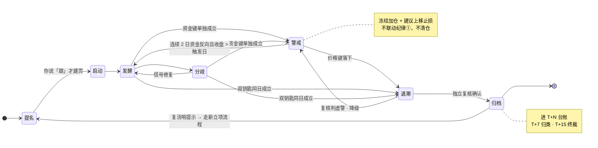

# 主线生命周期



**图上没画、但同样是硬规则的两条**：立项时预注册的**纯价格条件可以单键**直接进退潮（双钥匙只约束资金侧）；任一必需键**缺数据**时判定返回 `unverified`，写「本项未验证」，**不落到任何一个阶段转移上**。

完整演示见 [演示复盘](../examples/演示复盘.md) 与 [演示主线页](../examples/演示主线页.md)。

| 阶段 | 进入条件 | 退出或升级 |
|---|---|---|
| 提名 | AI 给出叙事、证据、反方和死亡条件雏形 | 用户说“跟”才立项 |
| 启动 | 催化、资金和价格开始共振 | 证据增强进入发酵；冲突进入分歧 |
| 发酵 | 资金持续、宽度扩散、载体确认 | 分化进入分歧；清仓级死亡条件成立转退潮 |
| 分歧 | 资金、价格或宽度信号冲突 | 修复后回发酵；清仓级死亡条件成立转退潮 |
| 警戒 | 清仓级条件的**资金键单独成立**，价格键未落下；或触发后复核判为“虚警 · 降级警戒” | 连续 2 个交易日资金键反向且收盘高于触发日收盘 → 解除；任一日价格键落下 → 升级为退潮 |
| 退潮 | 预注册的清仓级死亡条件成立（**资金键 + 价格键**，或已预注册的纯价格单键） | 提示纪律①并建议复核，不自动交易 |
| 归档 | 退潮证据链与复核结论建立，同轮建 T+N 复核档 | 只读保留；重新成立时走新立项，不原地复活 |

## 双钥匙与警戒态

清仓级死亡条件必须是**资金键 + 价格键**同时成立。资金键单独成立时，判的是 `警戒` 而不是 `退潮`：

- 警戒的动作**硬且可逆**：本主线冻结加仓 + AI 给上移止损建议（待用户确认）。
- 警戒**不联动纪律①、不清仓**；用户未确认前，纪律②仍按原止损位执行，AI 不自动移动止损位。
- 立项时预注册的**纯价格条件仍可单键触发**——双钥匙只约束资金侧，不豁免已写死的价格条件。

**为什么要这一档。** 纯资金符号条件（连续 N 日净流出、聚合窗口转负）在板块逐日史上的误报底率很高，触发后的前向收益与不触发几乎没有区别——**信号本身几乎不含信息**。让它单独扣动一个不可逆动作，等于给系统装了一个每隔几天就误响一次的清仓警报；真正的代价不是某一次误杀，而是人会因此在关键时刻不再信任触发器。

所以双钥匙的定位是**安全结构，不是已被证明有效的退潮预测器**：它降低单源低特异度信号直连不可逆动作的概率，不声称提高了预测精度。想在自己的数据上复核，见下文「回放与验证」。

## 判定规则版本

主线页 frontmatter 写 `判定规则版本`：

- `double_key_v1` —— 按双钥匙判。
- 无此字段的旧页按 `legacy_any` 与页面原文执行，**不得代为升级或降级**。

机械判定的唯一实现是 `stock-daily` 的 `scripts/mainline_validation.py::classify_retreat`。任一必需键缺数据时返回 `unverified / data_block`，**不得把缺失静默当成“未触发”**。

## 防锚定接力

机械候选池和正式提名是两个不同角色：前段只输出资金与宽度候选，不作取舍；后段必须先独立扫描，再看候选池并取并集，最后用催化剂、反方和死亡条件筛成 0–3 条正式提名。候选池不得写成“提名”。

每条正式提名另记四项 `shadow_only` 观察：涨停梯队映射、A 股催化落点、锚板块名次稳定性、次日证伪条件。四项**不阻断提名裁决**，但前两项同时告警时必须标注「A 股执行链未验证，证据高风险」。

## 死亡条件

- 立项前写；不得事后按行情改写。
- 清仓级必须双钥匙；只给得出资金键的条件只能是警戒级。
- 必须给出标的或指数代码、基线点位和基线数据日。
- **立项误报回测是强制项**：拉锚板块 120 日逐日史，报告该组合在过去 60 个交易日触发几次，> 1 次即改写条件。回测做不了就把裁决降为“观察”，不得跳过。
- 极端值判定必须**板块内标准化**（z 分数或主力净占比），禁止裸用全市场绝对额排名。
- 锚点的立项日取值必须与后续判定同源同接口。
- 依赖连续序列时必须能从板块逐日缓存回溯；不能回溯就标“本项未验证”，不得默认判“未触发”。
- 触发只产生纪律提示与 AI 建议，不产生委托。

## 复核、复活与台账

退潮判定是单源机械触发，直接联动纪律①，误判代价高，因此有三道回头机制：

1. **退潮复核判据（预注册）**——立项当轮就写进主线页，规定触发后按什么判，**触发当天不得追加或修改**。判据必须含至少一个非资金维度，否则复核与触发同源、结构上不可能推翻触发。
2. **退潮判定 T+N 台账**——每次退潮判定建一行，T+7 按预注册判据机械归类，T+15 终裁。检查点日期建档时写死，不随行情顺延。样本计数只数**真的执行了纪律①**的判定。
3. **复活哨**——已归档主线在判定日后 15 个交易日内，若锚板块连续 2 日主力净流入且收盘高于判定日收盘，复盘必须置顶「疑似误杀提示」。它的动作是**请用户决定是否重新评估，不是买回信号**；重评走新立项流程。

归类为“误杀”**不改变任何已执行的纪律动作**，不倒推、不追认、不补偿，只进样本池。

## 修订窗口

结构与判据一经定稿即冻结，直到台账攒够预定样本量或走到预定日期（先到为准）才开校准会。**在此之前任何单案结果都不触发规则修改。**

划界标准：不许做的是「看着某一案把 2 日改成 4 日」这类事后调参；许做的是修「单源低特异传感器直连不可逆动作」这类结构缺陷。判别方法是问一句——**该修改在不知道结果时是否同样成立。**

## 回放与验证

改动双钥匙、警戒、提名证据字段或次日证伪语义时，必须同轮跑行为回归：

```bash
cd <stock-daily skill 目录>
python3 -m unittest discover -s tests -p 'test_*.py'
python3 scripts/mainline_validation.py cases --fixtures tests/fixtures/mainline_cases.json
```

想用自己的数据复核双钥匙的立论，先把板块逐日缓存养到足够长，再跑：

```bash
python3 scripts/mainline_validation.py study --db <缓存库路径> --output-dir <输出目录>
```

**Gate 一旦预注册就不得按结果改门槛**；失败后追加的切片只能标 `post_gate_diagnostic_only`，不得反过来当成立论证据。
